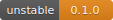

# Coffee app
Pre-work assignment project for CTD - Code The Dream.  
GNU Licence.  
Created by German Gambera.  

## Summary
Business: Advanced Course - React Web  
Author: German Gambera  
Date: 11-21-2024  

## Description
This is a web application project developed in Html-Css-Javascript that will be presented as part of the work prior to the advanced class to allow demonstrating general knowledge of APIs and software development. 
The chosen project is about a list of products from a Coffee Store.

## Versions
| Version  |    Date    | Description                    	           |  Author   |  Build   |
|:--------:|:-----------|:---------------------------------------------|:---------:|:--------:|
|  0.1.0   | 2024/11/21 | First version. Main features added           |    GG     |    5     |

## Content

* [Platform](#platform)
* [Project Requirements](#project-requirements)

* [Key Features](#key-features)
* [User Manual](#user-manual)
* [Contributing](#contributing)
* [Additional Information](#additional-information)

## Platform
#### Languages
* HTML 5
* CSS
* Javascript
#### Additional Tools
* API calls to services on [api.sampleapis.com](#api.sampleapis.com)
* Fonts Awesome 6.5.2
#### Main Components
* index.html
* style.css
* script.js

## Project Requirements
#### Structure
* A public GitHub repository containing your project
* An HTML document for the page
* A CSS document to style the HTML page
* A JavaScript file that retrieves data from one of several public API sources to * display the data on your HTML page
* A README file that includes the instructions for running the webpage
#### Content
* Display the data for at least 2 of the end-points in the API
* Include navigation from each end-point’s page to the other end-points that are displayed
* Issue new GET requests for the linked data to display in the linked pages.
#### Functionality
* Be sure that we can get the code to run without issues by following the instructions in the README file
* Be sure navigation between the different end-points behaves properly and is not slowed down by requesting more data than needs to be displayed
* Be sure your code is readable and well structured
* If including a user-interactive feature like a search field, be sure that you appropriately handle error cases
* Be thoughtful about what type of styling is used (example: font-sizes are not too small or large, colors are not too dark/light to be easily seen, etc.)

## Key Features
This project represents the use of a list of products from a coffee warehouse using calls to two public API services available on the web at https://api.sampleapis.com/coffee/.
It was developed in HTML5, CSS, and basic javascript functions without using any framework. The focus was on design and style and trying to use best practices. The application is responsive web. Below are the main features
### Main Panel
### Search block
### Menu Options
### List of Products
### Modal Panel

## Contributing
Copyright © German Gambera.  
All rights reserved.

## Additional Information
N/A

[Go to Top](#coffee-app)  